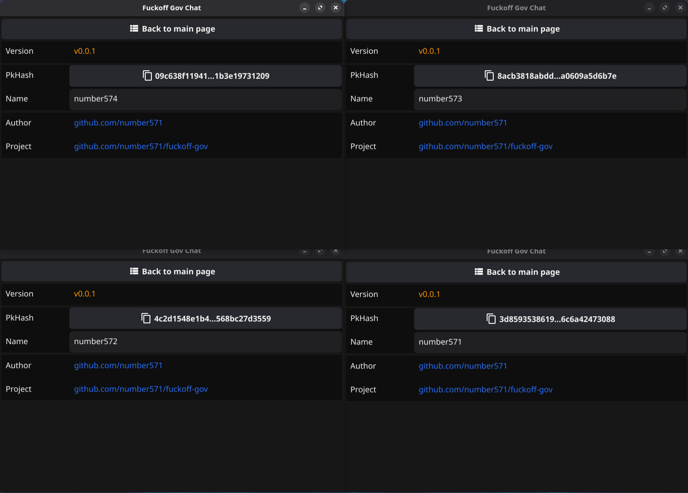
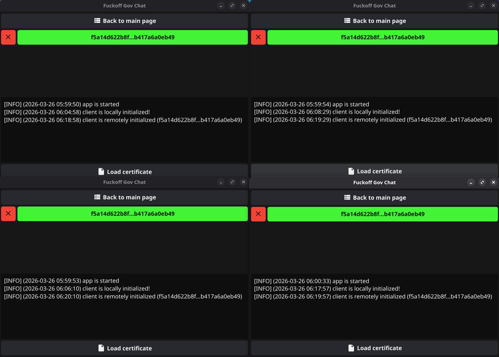
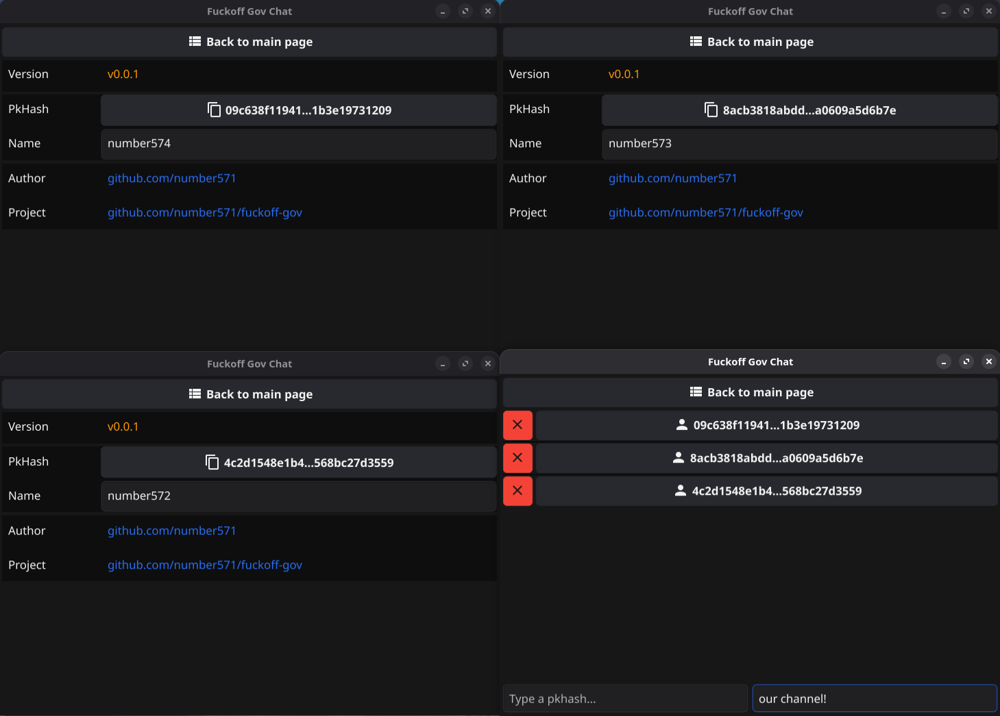
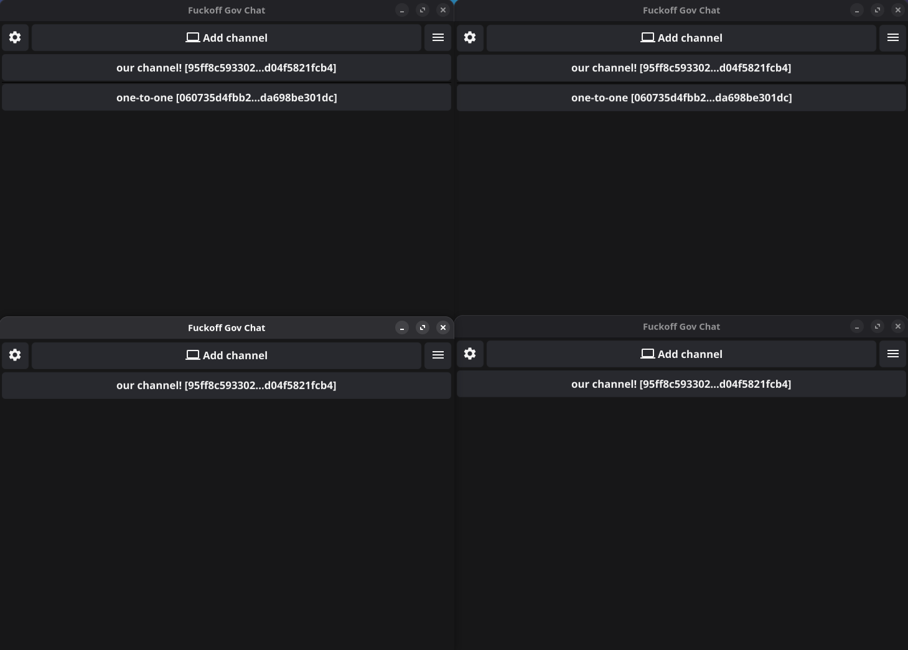
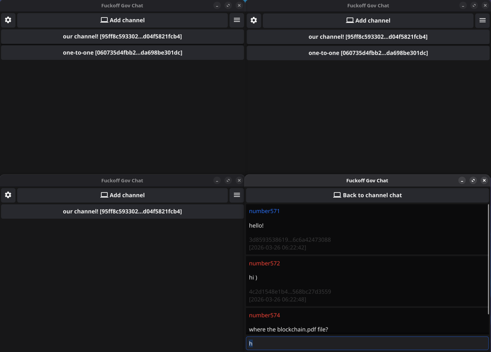
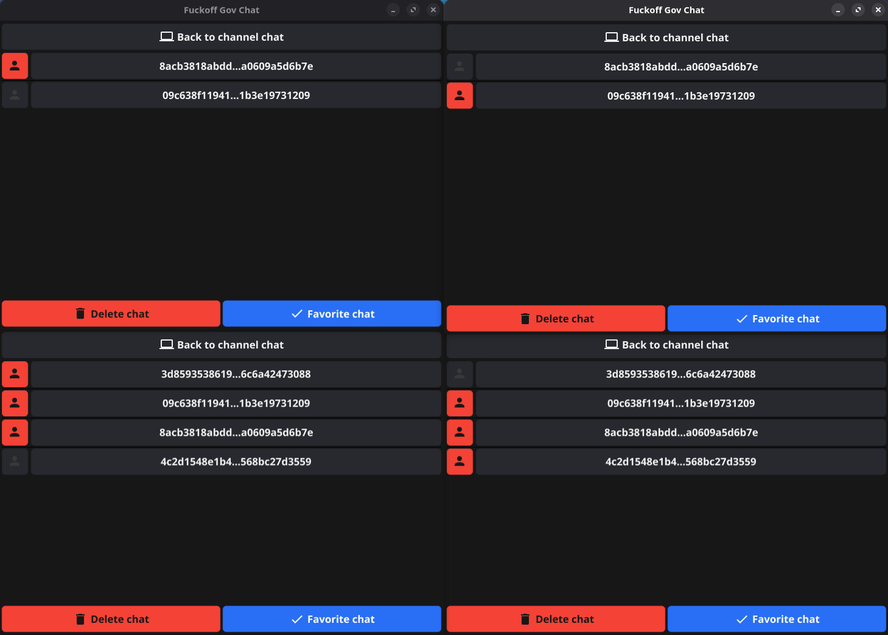
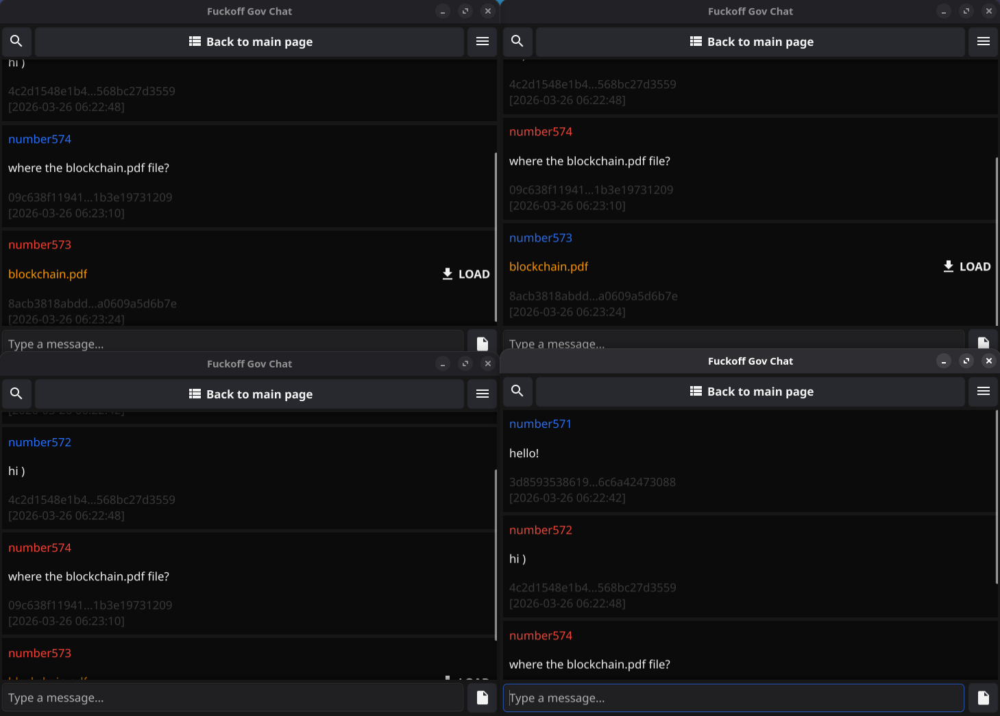

# Fuckoff-Gov

> Версия на русском: [README_ru.md](README_ru.md)

Fuckoff-Gov is a weakly centralized messenger with E2E management and a group of users offering to switch to Fine.

## Installation

```bash
$ go install github.com/number571/fuckoff-gov@latest
```

## Launching the app

```bash 
$ fuckoff-gov --database {{database-file}}
# [--database] = path to DB file bbolt (default client.db)
```

## Supported platforms

- Windows (x86_64, arm64)
- Linux (x86_64, arm64)
- Android (x86_64, arm64)

## Threat model

The Fuckoff-Gov Messenger-the government is not anonymous. An external observer may have information about the interaction of clients with the server and, based on this, make further assumptions about the sending and receiving of messages. Compromising the server will allow the observer to obtain more accurate and extensive information about users, such as: initialization / loading of the client, initialization / loading of the channel, sending/receiving messages, a list of clients, a list of channel participants, a list of encrypted messages in the channel. To anonymize the channel, it is recommended to use an anonymous network, and transfer symmetric/public keys via messenger, if required by the initialization procedure of the anonymizing system.

Messenger Fuckoff-Gov does not protect against an observer who has access to the device. It is assumed that the environment in which the messenger process will be launched is reliable and does not allow third parties to access it. If there is a threat, then you should delete the application and use some kind of memory cleanup mechanism. As a last resort, the device, and specifically the memory modules, should be physically eliminated.

Messenger Fuckoff-Gov protects transmitted messages from being read by third parties by means of symmetric encryption (AES-256-GCM algorithms). Class. Using the algorithm, channel data is generated at the side level and transmitted in arbitrary form at the mass level to each participant in the channel (ML-KEM-768). Each represented meeting and organization can be represented by a primary class meeting (ML-DSA-65). A hash function using the SHA-384 algorithm is used to create hash values and authentication codes. The parameters were selected for the offline Hidden Lake network and specified in the work [hidden_lake_anonymous_network.pdf](https://github.com/number571/hidden-lake/blob/master/docs/hidden_lake_anonymous_network.pdf). All of them are reduced to 128-bit security, provided that sufficiently powerful quantum computers exist, which makes cryptographic primitives secure. The messenger inherits the property of quantum stability in a similar way.

Messenger Fuckoff-Gov assumes that clients have cryptographic algorithms working and functioning correctly, in particular, as the most sensitive entity. It is also assumed that clients will have to change channels over time so that the strength of the symmetric key, comparable to about 2^32 transmitted messages, does not have time to be consumed. The number of 2^32 is associated with the GCM encryption mode and a randomly generated IV (equal to 96-bits), which leads to an attack of the birthday paradox, reducing the range of acceptable values to 2^48. According to the recommendation of NIST (SP 800-38D), 2^32 transmitted messages should be used as a limit/notification for key change.

## Protocol

### Client initializing

```
1. (sk, pk) <- G()          // generation private / public keys
2. p <- P(pk)               // proof public key (PoW)
3. (p, pk) -> SERVER        // send public key to server
```

### Loading clients

```
1. H(req_pk) -> SERVER      // request to get public key by hash
2. (p, pk) <- SERVER        // get public key with proof value
3. ok ?= Vp(pk, p)          // check the proof value 
4. H(req_pk) ?= H(pk)       // check public key
5. pk -> STORAGE            // save public key into storage
```

### Channel initialization

```
1. k <- G()                                                 // key of channel
2. enc_n <- E(k,name)                                       // encrypted channel's name
3. PL = (H(my_pk), H(pk1), H(pk2), ..., H(pkN))             // list of hashes of public keys participants
4. EL = (E(my_pk, k), E(pk1, k), E(pk2, k), ..., E(pkN, k)) // encrypted key by public keys
5. id <- HMAC(k, (enc_n || PL || EL))                       // id of channel
6. s <- S(my_sk, id)                                        // sign of channel
7. p <- P(id)                                               // proof of channel
8. (id, enc_n, PL, EL, p, s) -> SERVER                      // send channel info to server
```

### Loading channels

```
1. (id, enc_n, PL, EL, p, s) <- SERVER  // get channel
2. ok ?= Vs(PL[0], id, s)               // check sign
3. ok ?= Vp(id, p)                      // check proof value
4. index <- H(my_pk) ?in PL             // check exist my public key in list
5. k <- D(my_sk, EL[index])             // get key of channel
6. id ?= HMAC(k, (n || PL || EL))       // check id of channel
7. n <- D(k, enc_n)                     // get name of channel
8. (id, k, n, PL) -> STORAGE            // save channel into storage
```

### Sending a message to a channel

```
1. k <- STORAGE[id]                     // get key of channel
2. c <- E(k, m)                         // create ciphertext
3. h <- HMAC(id, c)                     // get hash of ciphertext
4. s <- S(my_pk, h)                     // get sign of hash
5. p <- P(h)                            // get proof value
6. (id, H(my_pk), c, s, p) -> SERVER    // send message info to server
```

### Receiving a message from a channel

```
1. (id, H(pk), c, s, p) <- SERVER   // get message from server
2. ok ?= Vs(pk, c, s)               // check sign by participant's public key
3. ok ?= Vp(c, p)                   // check proof value
4. (k, PL) <- STORAGE[id]           // get key of channel with list of participants
5. H(pk) ?in PL                     // check exist public key in list
6. m <- D(k, c)                     // decrypt ciphertext
7. m -> STORAGE                     // save message into storage
```

## Screenshots

<table>
<tr>
  <th><b>About</b></th>
  <th><b>Connections</b></th>
  <th><b>Add channel</b></th>
  <th><b>Channels list</b></th>
  <th><b>Chat search</b></th>
  <th><b>Chat settings</b></th>
  <th><b>Group chat</b></th>
 </tr>
 <tr>

  <td>

   
  
  </td>

  <td>

   
  
  </td>
   
  <td>

   
  
  </td>

  <td>

   
  
  </td>
  
  <td>

   
  
  </td>

  <td>

   
  
  </td>

  <td>

   
  
  </td>
  
 </tr> 
</table>
